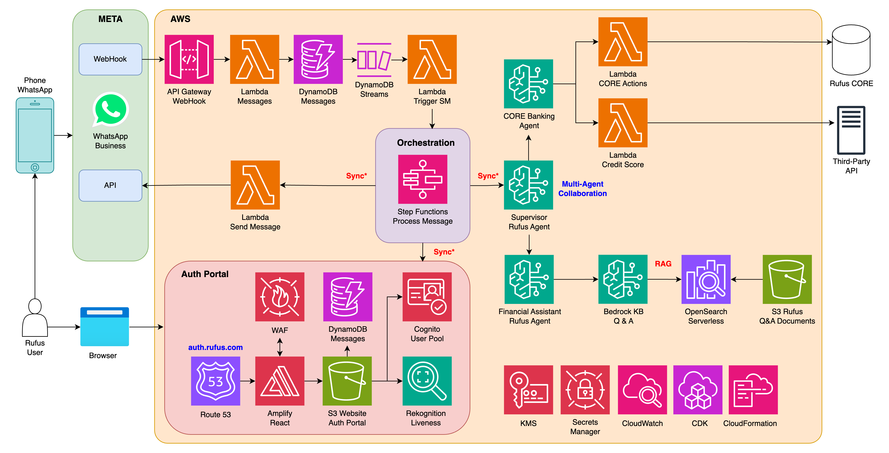

# 🏦 AWS-WHATSAPP-BANK-DEMO 🏦

Multi-layered Enterprise WhatsApp Chatbot solution designed for a demo Bank, leveraging AWS's advanced Generative AI capabilities.  

- Biometric authentication portal with React + Amplify + Cognito + S3 + Rekognition Liveness.
- WhatsApp Chatbot enabled via a WebHook on top of API-GW + Lambda + DynamoDB (with EDA approach).
- Multi-Agent Collaboration with Bedrock and Nova Pro V1 (2 Generative-AI Agents).
- Infrastructure as Code with Cloud Development Kit (CDK-Python) and 3 Stacks.

## Architecture

  

## Manual Steps (Only Once)

- [WhatsApp Manual Configuration](./docs/WHATSAPP_CONFIGURATION.md)
- [AWS Configuration](./docs/AWS_CONFIGURATION.md)

## DEMO

<video src="assets/2025_02_11_RufusBank_Demo_MultiAgentChatbot.mp4" width=50%>  

## Author 🎹

### Santiago Garcia Arango

<table border="1">
    <tr>
        <td>
            
Curious Solutions Architect experienced in DevOps and passionate about advanced cloud-based solutions and deployments in AWS. I am convinced that today's greatest challenges must be solved by people that love what they do.

        </td>
        <td>
            

        </td>
    </tr>
</table>

## LICENSE

Copyright 2025 Santiago Garcia Arango.
