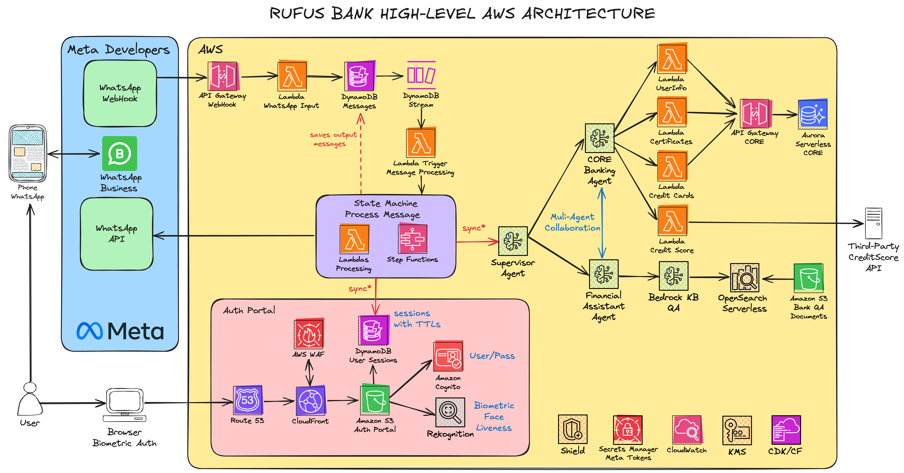

# 🏦 AWS-WHATSAPP-BANK-DEMO 🏦

Multi-layered Enterprise WhatsApp Chatbot solution designed for a demo Bank, leveraging AWS's advanced Generative AI capabilities.  

> WORK IN PROGRESS!!!!

## Architecture

  

## Manual Steps (Only Once)

- [WhatsApp Manual Configuration](./docs/WHATSAPP_CONFIGURATION.md)
- [AWS Configuration](./docs/AWS_CONFIGURATION.md)

## Author 🎹

### Santiago Garcia Arango

<table border="1">
    <tr>
        <td>
            
Curious Solutions Architect experienced in DevOps and passionate about advanced cloud-based solutions and deployments in AWS. I am convinced that today's greatest challenges must be solved by people that love what they do.

        </td>
        <td>
            

        </td>
    </tr>
</table>

## LICENSE

Copyright 2025 Santiago Garcia Arango.
